# Verschlüsseltes FileSystem mit DM-Crypt und LUKS 🍹

# Inhaltsverzeichnis

<!-- vim-markdown-toc GFM -->

* [Vorbereitung und Software](#vorbereitung-und-software)
  * [Aufgabenstellung](#aufgabenstellung)
  * [Ablauf](#ablauf)
  * [Software / Dependencies](#software--dependencies)
* [Theoretische Grundlagen](#theoretische-grundlagen)
  * [Festplattenverschlüsselung](#festplattenverschlüsselung)
  * [Device Mapper](#device-mapper)
  * [DM-Crypt](#dm-crypt)
  * [LUKS](#luks)
* [Installation](#installation)
  * [cryptsetup mit LUKS](#cryptsetup-mit-luks)
  * [Dependencies](#dependencies)
    * [popt](#popt)
  	* [device mapper](#device-mapper)
* [Changelog - VMware-Image](#changelog---vmware-image)
  * [Changelog](#changelog)
  * [VMware](#vmware)
    * [Parition](#parition)
* [Evaluierung / Testläufe](#evaluierung--testläufe)
  * [cryptsetup](#cryptsetup)
* [Diskussion und eigene Bewertung](#diskussion-und-eigene-bewertung)
* [Zusammenfassung](#zusammenfassung)
* [Quellen](#quellen)

<!-- vim-markdown-toc -->

## Vorbereitung und Software

### Aufgabenstellung

Beispielgebend für unterschiedliche Arten der Festplattenverschlüsselung wird DM-Crypt behandelt. DM-Crypt verschlüsselt Container/Partitionen und ist über virtuelles Blockdevice (/dev/mapper) ansprechbar, das als Filesystem gemountet werden kann. LUKS (Linux Unified Key Setup) dient dabei zum Schlüsselmanagement. Es ist daher DM-Crypt & LUKS in der vorgegebenen Slackware Distribution (VMware Image) einzukompilieren, zu konfigurieren und der Betrieb zu evaluieren. Im Zuge der Präsentation ist dies abschließend live vorzuführen.

---

### Ablauf

1. cryptsetup mit LUKS und Dependencies einkompilieren
2. Kernel Einstellungen ändern und neuen Kernel kompilieren/erstellen
3. Partition zu VM hinzufügen
4. Verschlüsselung der Partition mit cryptsetup und LUKS

---

### Software / Dependencies

#### Dependencies Tree

---

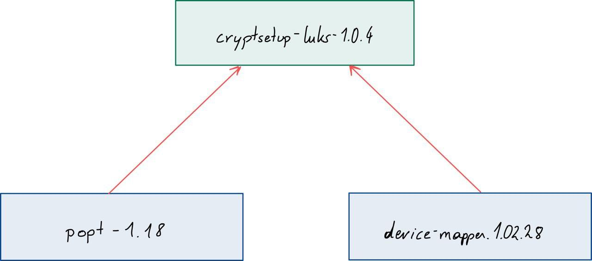</img>
	

## Theoretische Grundlagen

### Festplattenverschlüsselung

---

Allgemein unter Festplattenverschlüsselung bzw. verschlüsselt Filesystem versteht man das Verschlüsseln einer Festplatte oder einer einzelnen Partition, um den unbefugten Zugriff auf sensible Daten zu verhindern.
Wichtig ist das die zum Booten verwendeten Daten unverschlüsselt bleiben da man sonst einen speziellen Bootmanager braucht zum Entschlüsseln braucht.

Meistens werden die Festplatten mit einem Passworts verschlüsselst, es gibt aber auch alternative Hardwareunterstützte Authentisierung mittels Security-Token, Fingerabdruck, PIN-Eingabe oder Chipkarten.

Durch den Zusätzlichen Rechenaufwand der Verschlüsselungsalgorithmen kann es zu Performanceinbüßungen kommen, der Datendurchsatz sinkt gegenüber unverschlüsselter Datenträger.
Eine Lösung wäre es einen schnelleren Prozessor zu verwenden oder durch die Verwendung von vorher genannten Hardware wie Security Token.

Es gibt verschiedene Softwaren für die unterschiedlichen Betriebssyteme um die Festplatte zu verschlüsseln:

- Windows: Bitlocker
- Linux: Loop-AES und DM-Crypt mit LUKS
- macOS: FileVault


### Device Mapper

---

Der Device Mapper wird hauptsächlich für den Logical Volume Manager (LVM) und für Geräteverschlüsselung verwendet. 
Er erlaubt die Erzeugung virtueller blockorientierter Geräte, indem er deren Adressbereich auf andere blockorientierte Geräte oder spezielle Funktionen abbildet.
Blockorientierte Geräte übertragen Daten in Blöcken und werden oft für die parallele Datenübertragung genutzt.


### DM-crypt

---

DM-Crypt ist ein Kryptografie Modul des Device Mappers im Linux Kernel. 


Es können verschiedene Algorithmen verwendet werden, wie z.B.:
- Mehrere aes versionen
	- aes-cbc-essiv:sha256 
	- aes-xts-plain64 
	- aes:64-cbc-lmk 
- Twofish
- Serpent

Mit dm crypt können wir mit dem verschiedenen Algorithmen unsere Daten ver- und entschlüsseln, das kann man auf beliebige Gerätedateien anwenden, meisten auf Paritionen, Festplatten oder logischen Laufwerken. 

Es wird eine zusätzliche Schicht zwischen verschlüsselten Rohdaten und dem Dateisystem aufgebaut. Für den Benutzer ist der Prozess vollkommen Transparent, deshalb wird es oft für die Festplattenverschlüsselung verwendet. 


### LUKS

---

LUKS steht für Linux Unified Key Setup.

Erweitert die verschlüsselte Datei um eine Header datei, in dem Metadaten sowie bis zu acht Schlüssel gespeichert werden
Zusätzlich kann mit der Hilfe von LUKS der Schlüssel bzw. Einer der acht Schlüsseln jederzeit geändert oder gelöscht warden, ohne die verschlüsselten Daten neu umschreiben zu müssen.

Ein Nachteil von LUKS ist, dass im Header stehen ziemlich viele Informationen z.b. eine Klartextkennung, den verwendeten Verschlüsselungs- und Hash-Algorithmus und die Größe des Masterschlüssels.
Das führt dazu das LUKS leicht zu verwalten ist, aber eben auch gegenüber Dritte oder Angreiferprogramme leicht erkennbar ist.


## Installation

### cryptsetup mit LUKS

---

```
tar xf cryptsetup-luks-1.0.4.tar.gz
cd cryptsetup-luks-1.0.4
./configure --prefix=/usr
make
make install
```

### Dependencies

---

#### popt

---

```
tar xf popt-1.18.tar.gz
cd popt-1.18
./configure --prefix=/usr
make
make install
```

### device mapper

---

```
tar xf device-mapper.1.02.28.tar.gz
cd device-mapper.1.02.28
./configure --prefix=/usr
make
make install
```

## Changelog - VMware-Image

### Changelog

Bei meinen vielen Versuchen `cryptsetup` zum Laufen zu bringen, habe ich die neueste Version von `tar` mit den `utils xz` einkompiliert.

#### tar

---

```
tar xf tar-latest.tar.gz
cd tar-latest
./configure --prefix=/usr
make
make install
```

#### utils xz

---

```
tar xf xz-5.2.5.tar.gz
cd xz-5.2.5
./configure --prefix=/usr
make
make install
```


### VMware

#### Parition

Für mein Beispiel muss eine extra Parition in VMBox zu der VM eingefügt werden

1. Zuerst muss man in VirutalBox in den Virutal Media Manager rein, auch mit STRG+D möglich.

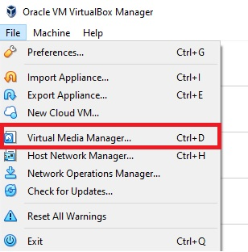</img>

2. Im Virtual Media Manager wählt man dann ein neues Medium erstellen aus, siehe Bild 2

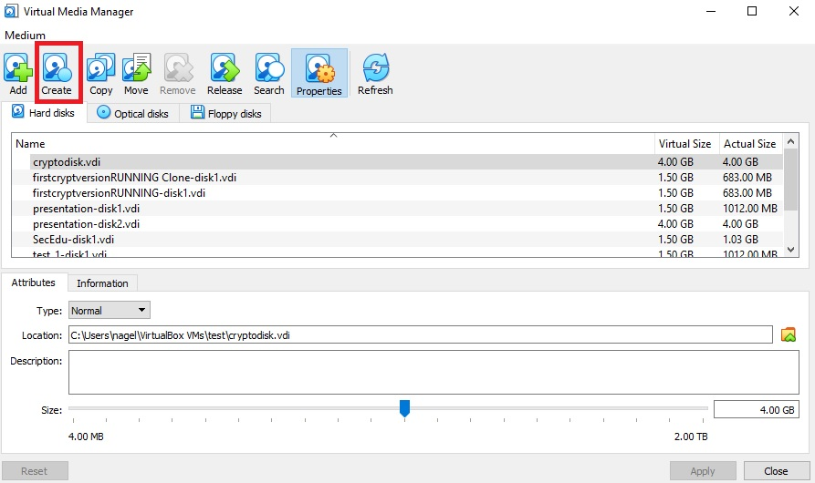</img>

3. In Bild 3 und 4 die ausgewählten Optionen lassen und weitergehen.

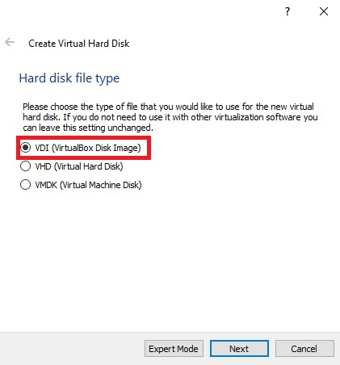</img>
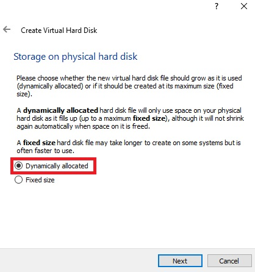</img>

4. Im nächsten Schritt kann man den Namen und die Größe der Partition einstellen, in dem Beispiel hab ich alles auf Standard gelassen

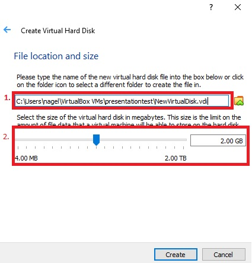</img>

5. Im Virtual Media Manager sieht man die neu erstellte Partition

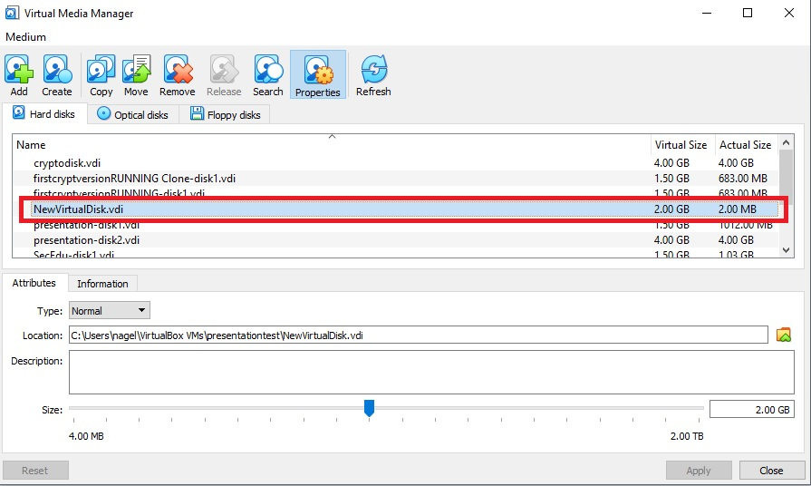</img>

6. Jetzt muss die neu erstellte Parition noch der VM hinzugefügt werden, dazu geht man in die Settings der gewünschten VM

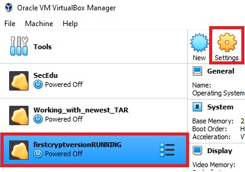</img>

7. In dem Reiter Storage kann dann dem schon vorhandenen `Controller: IDE` eine neue Disk hinzugefügt werden, es ist wichtig in den schon vorhandenen Controller einzubinden, da die Partition sonst nicht gefunden wird bzw. wurde.

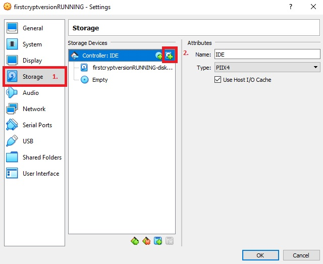</img>

8. Falls die Disk noch nirgends hinzugefügt worden ist, ist sie ganz unten in der Liste unter `Not Attached` aufgelistet

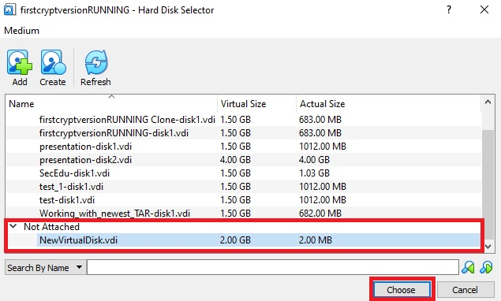</img>

9. Die Partition wurde erfolgreich der VM hinzugefügt

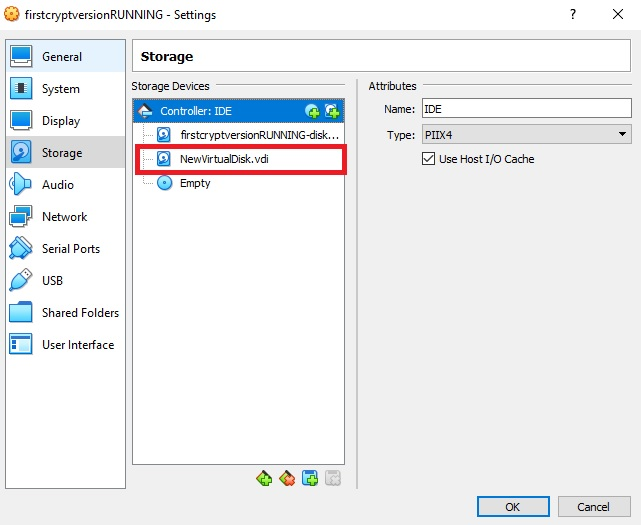</img>

## Evaluierung / Beispiel

### How to use cryptsetup 

---

#### Konfigurieren einer LUKS Partition

---

Zuerst wird die zuvor eingefügte Partition gesucht mit dem Befehl

`fdisk -l`

TODO: Bild der Ausgabe

wenn die Partition gefunden wurde, wird sie in mit dem Befehl konfiguriert

`cryptsetup -y -v luksFormat /dev/hdb1`

TODO: Bild der Ausgabe

-y = zweimal das Passwort eingeben (doppelcheck)
-v = verbose

Inizialisiert das Volume und setzt einen ersten Schlüssel oder Passwort
der Schlüssel kann nicht wieder hergestellt werden, also nicht vergessen, 
um typos zu verhindern nehme ich ein besonders leichtes Passwort!

`cryptsetup luksOpen /dev/hdb1 crypto`

TODO: Bild der Ausgabe

**PW Hallo**

wenn der Schlüssel erfolgreich verifiziert worden ist können wir mit folgendem Befehl sehen,
ob luksFormat gemapped worden ist

`ls -l /dev/mapper/crypto`

TODO: Bild der Ausgabe

um den Status auszugeben nehmen wir folgenden Befehl

`cryptsetup -v status crypto`

TODO: Bild der Ausgabe

mit dem luksDump Befehl wird der LUKS header dargestellt

`cryptsetup luksDump /dev/hdb1`

TODO: Bild der Ausgabe

#### Format Linux LUKS partition

---

Zuerst müssen wir "NULLER" auf unser encryptetes Gerät schreiben. Das machen wir um 

Zuerst müssen Sie Nullen in das verschlüsselte Gerät / dev / mapper / backup2 schreiben. 
Dadurch werden Blockdaten mit Nullen zugewiesen. Dies stellt sicher, 
dass die Außenwelt dies als zufällige Daten betrachtet, d. H. Es schützt vor der Offenlegung von Nutzungsmustern
kann ewig dauern

`dd if=/dev/zero of=/dev/mapper/crypto`

TODO: Bild der Ausgabe


Als nächstes erstellen wir ein Filesystem, wir verwenden reiserfs (bzw. killerfs), 
weil die anderen Format nicht unterstützt werden

`mkfs.reiserfs /dev/mapper/crypto`

TODO: Bild der Ausgabe

der nächste Schritt ist, das Volume zu mounten um darauf zugreifen zu können, 
die Schritte gehe ich jetzt schneller durch

```mkdir /mnt/cryptomount
mount /dev/mapper/crypto /mnt/cryptomount
df -H
cd /mnt/cryptomount
ls -l
```

TODO: Bild der Ausgabe und was ich damit bewirke

#### Unmount und Daten sichern

---

um die Daten zu sichern, muss das Volume zuerst unmountet werden und dann mit luksClose gesichert

`umount /mnt/cryptomount`

`cryptsetup luksClose crypto`

TODO: Bild der Ausgabe

#### remount die encrypte Partition

---

davor kann man nochmal schauen ob sie gemountet ist

`df -H`

danach wieder entcrypten und mounten:

```cryptsetup luksOpen /dev/hdb1 crypto
mount /dev/mapper/crypto /mnt/cryptomount
df -H
```

TODO: Bild der Ausgabe

mount => anschauen was ich damit bezwecke ^^, type wird angezeigt => reiserfs

#### Schlüssel hinzufügen

---

um weitere Schlüssel hinzufügen machen, verwenden wir folgenden Befehl:

`cryptsetup luksDump /dev/hdb1`

TODO: Bild der Ausgabe

`cryptsetup luksAddKey /dev/hdb1`

TODO: Bild der Ausgabe

1. aktuelles Passwort eingeben
2. anderes Passwort eingeben (Test123)

`cryptsetup luksDump /dev/hdb1`

TODO: Bild der Ausgabe

#### Schlüssel löschen

---

`cryptsetup luksRemoveKey /dev/hdb1`

TODO: Bild der Ausgabe

## Diskussion und eigene Bewertung 


alte Slackware => alte cryptsetup Version, macht vieles leichter

## Zusammenfassung

TODO: kurze Zusammenfassung, na no na ned ^^

## Quellen

Links ^^


# sources and further reading

* [binutils] GNU Binary Utilities Documentation. (2002). Retrieved from http://www.gnu.org/software/binutils/manual/
* [c11] ISO, & IEC. (2010). ISO/IEC 9899:201x, International Standard Programming languages — C, Committee Draft (N1570 ed.). ISO/IEC. Retrieved from http://www.open-std.org/jtc1/sc22/wg14/www/docs/n1570.pdf
* [compsec] Stallings, W. (2018). Computer Security: Principles and Practice, Global Edition (4th ed.). Pearson.
* [edvac] Von Neumann, J., & Godfrey, M. D. (1993). First Draft of a Report on the EDVAC. IEEE Annals of the History of Computing, 15(4), 27–75. https://doi.org/10.1109/85.238389
* [inteldev] Intel. (2011). Intel 64 and IA-32 Architectures Software Developer’s Manual Combined Volumes. System, 3(253665). https://doi.org/10.1109/MAHC.2010.22
* [pracbin] Andriesse, D., & Francisco, S. (2018). PRACTICAL BINARY ANALYSIS Build Your Own Linux Tools for Binary Instrumentation, Analysis, and Disassembly (2nd ed.). No Starch Press.
* [x64beg] Hoey, J. Van. (2019). Beginning x64 Assembly Programming: From Novice to AVX Professional Paperback (1st ed.). Apress.
